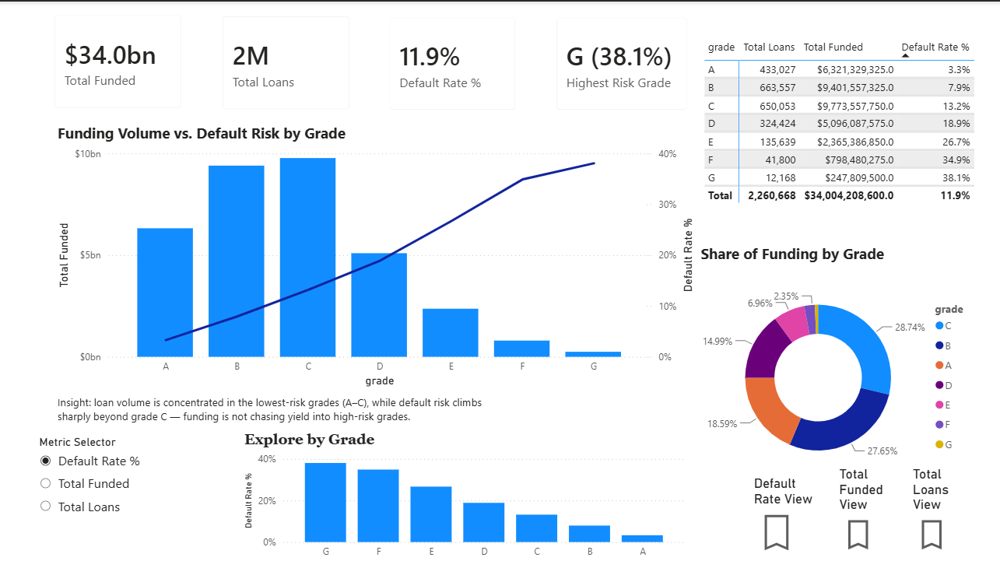
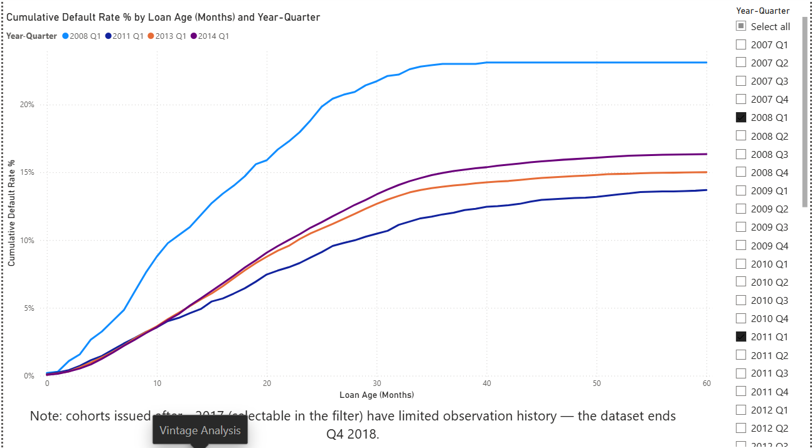
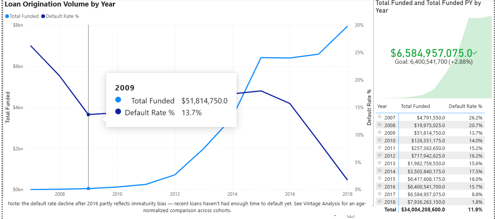
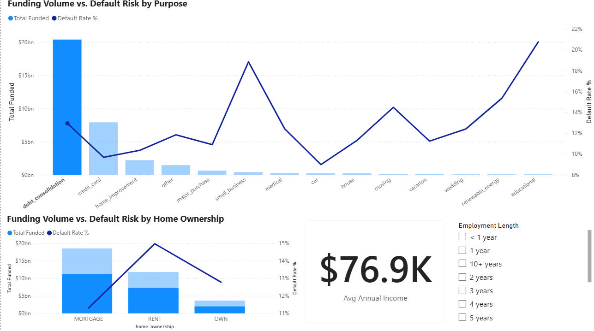
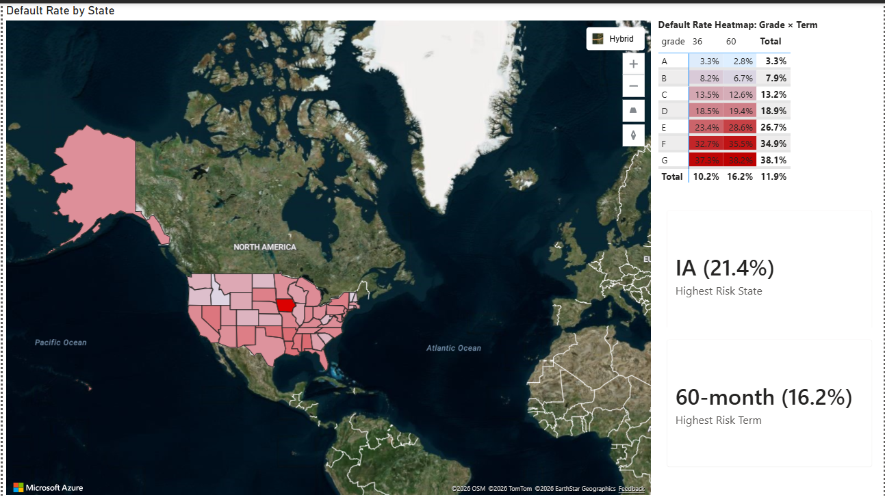
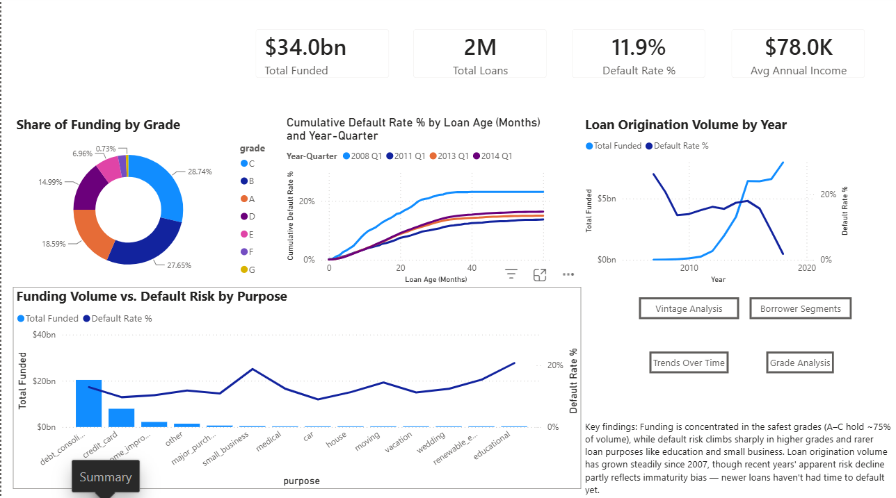

# Loan Portfolio Risk Analysis

A Power BI dashboard analyzing default risk across a 2.26-million-row consumer loan portfolio (LendingClub, 2007–2018), built to demonstrate advanced DAX, performance engineering, and row-level security on a real-world "large data, real stakes" dataset.

## The problem

A consumer lender wants to understand where default risk actually concentrates — by credit grade, loan purpose, borrower state, loan term, and vintage (origination cohort) — and needs that view to stay fast and secure as the portfolio scales past 2 million loans.

## Data

- **Source**: [LendingClub loan data, 2007–2018Q4](https://www.kaggle.com/datasets/wordsforthewise/lending-club) (Kaggle)
- **Scale**: 2,260,668 loans after cleaning (33 malformed rows removed), trimmed from 151 raw columns to 20 relevant ones
- **Grain**: one row per loan

## Architecture

**Star schema**: `FactLoans` (detail, import mode) + `DimDate`, `DimLoanAge` (disconnected cohort table), field-parameter table.

**Aggregation table** (`FactLoansAgg`): loans grouped by issue date / grade / state / term (55,594 rows, 40x smaller than detail). Built to test whether pre-aggregation would speed up visuals at this scale — validated lossless against the detail table (loan count and default count match exactly), but honestly found it did **not** meaningfully speed up visual queries, since VertiPaq was already answering detail-level queries in ~30ms. The real bottleneck at this scale is refresh time, not query time — which is what incremental refresh actually solves (see Performance section).

**Incremental refresh**: partitioned by year, `RangeStart`/`RangeEnd` parameters, 12-year archive / 1-year refresh policy. Caveat: the CSV source doesn't support query folding, so even the incremental refresh scans the full 1.6GB file via gateway — the win comes from only *rebuilding* 1 of 13 partitions, not from reduced I/O. A foldable source (e.g., SQL Server) would likely bring this down to seconds.

## Report pages

### Grade Analysis
Funding volume vs. default risk by credit grade (A–G), an interactive metric explorer (field parameters + bookmarked scenario views), share-of-funding donut, detail matrix.

### Vintage Analysis
Cumulative default rate by loan age, compared across origination cohorts — a disconnected-table cohort analysis. The 2008 Q1 crisis-era cohort plateaus near 24%, visibly above every later vintage.

### Trends Over Time
Portfolio growth and default rate by year, with a YoY KPI card and drill-down matrix.

### Borrower Segments
Risk by loan purpose and home ownership, plus borrower income/tenure.

### Geographic & Term Risk
Default rate by state (Azure Maps choropleth) and a grade × term risk heatmap.

### Summary
Executive dashboard synthesizing all five categories, with page-navigation buttons.

## Key findings

1. **Funding is concentrated in the safest grades.** Grades A–C hold ~75% of total funding, while default risk climbs sharply from grade C onward (3.3% → 38.1% at grade G) — the portfolio is not chasing yield into high-risk paper.
2. **Right-censoring bias, caught twice.** Both the vintage-cohort curves and the raw yearly default-rate trend initially appeared to show recent years as "safer" — this is a data-maturity artifact (recent loans haven't had time to default), not a real risk improvement. Both pages carry an explicit caveat rather than an oversold "risk is improving" claim.
3. **Risk climbs sharply for less-common loan purposes.** `debt_consolidation` and `credit_card` (the bulk of volume) sit around 13% default; `small_business`, `moving`, and `educational` climb toward 20–22%.
4. **Geographic and term concentration.** Iowa stands out as the highest-risk state (21.4%); 60-month loans default at nearly double the rate of 36-month loans (16.2% vs. 10.2%).
5. **Loan volume grew steadily from 2007 through 2018**, consistent with LendingClub's known growth trajectory.

## Performance

| Test | Refresh scope | Duration | Notes |
|---|---|---|---|
| Desktop full load | All 13 partitions | 24m 0s | Baseline |
| Desktop incremental refresh | 1 partition | 4m 29s | **5.4x faster, 81% reduction** |
| Page load (Grade Analysis, before) | — | 2,186 ms | 13 visuals, clean Performance Analyzer run |
| Page load (Grade Analysis, after) | — | 1,315 ms | **39.8% faster**, after removing 8 unused columns |

The column removal (`id`, `loan_amnt`, `int_rate`, `installment`, `sub_grade`, `dti`, `fico_range_low`, `out_prncp` — none used by any measure, visual, relationship, or the aggregation table's dependency chain) cleared the project's ≥30% improvement target. Note: the .pbix file size did *not* shrink alongside this (87.2MB → 88.4MB), because six new pages and dozens of visuals were added between the two measurements — the load-time figure is the clean, isolated metric; file size is not.

## Row-level security

Two regional roles (`West Coast Manager`, `Northeast Manager`) filter loans by `addr_state`. While building RLS, found and fixed a real gap: the aggregation table (`FactLoansAgg`) has no relationship to `FactLoans`, so a rule on `FactLoans` alone silently would not have restricted it. Both tables now carry matching filter rules.

## Interactivity

- **Field parameters** let users swap the metric on the "Explore by Grade" chart (Default Rate % / Total Funded / Total Loans)
- **Bookmarks + Bookmark navigator** capture those three metric states as one-click "scenario views"
- **Custom tooltip page** shows grade-specific detail (Total Funded, Total Loans, Default Rate %) on hover, instead of Power BI's plain default tooltip
- **Page navigation buttons** on the Summary page link directly to each detail page

## A platform note

Mid-build, Power BI's classic Filled Map visual returned a live "this visual type is being retired soon" warning — Microsoft is migrating map visuals onto the newer Azure Maps engine. Rather than fight the deprecated visual, the geographic map was rebuilt on Azure Maps directly (Format pane → Layers → Filled map layer → gradient fill by Default Rate %), which is the actively maintained path forward.

## Tech stack

Power BI Desktop, Power Query (M), DAX (time intelligence, disconnected tables, TOPN patterns), Power BI Service (incremental refresh, RLS, gateway), Performance Analyzer.
